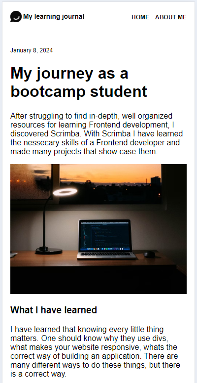
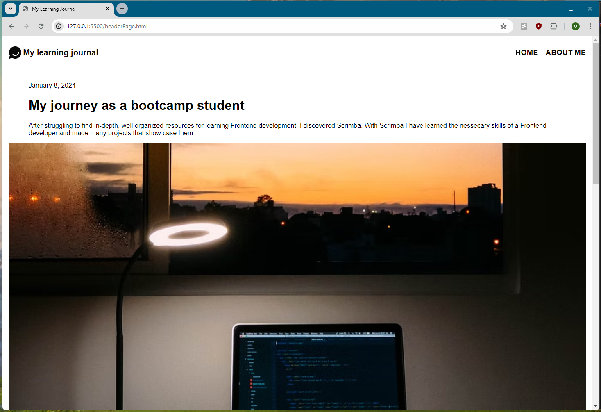
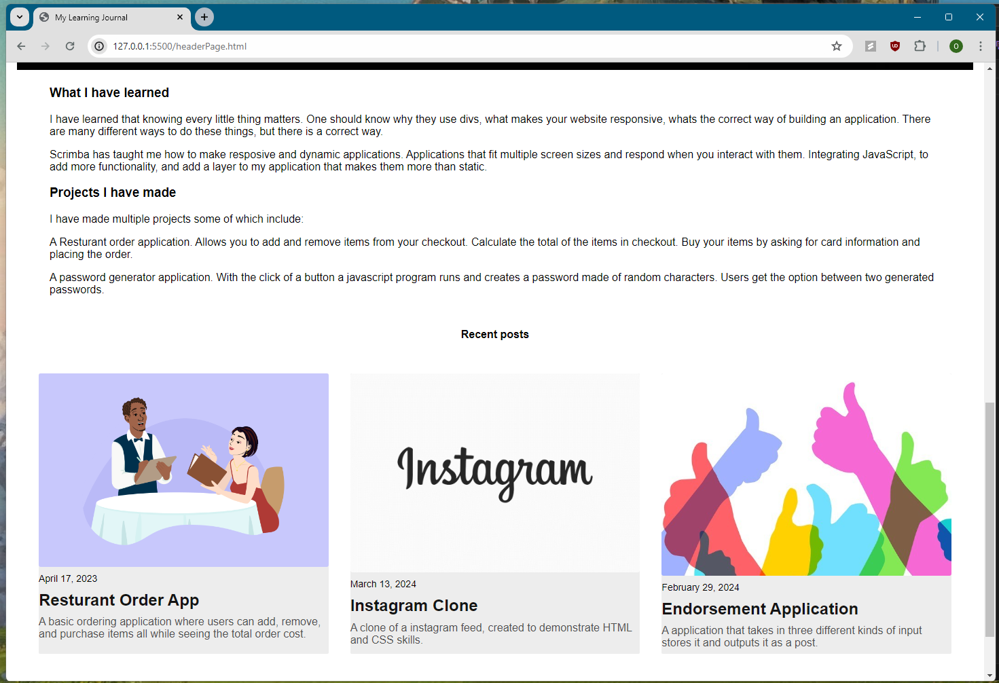

# My Journal Website

Fully responsive website that adjusts to mobile phone and desktop screens. 

- Website adjusts to different screen sizes
- Links take you to different pages/GitHub Repositories 

## Features

- CSS grid utilized to organize posts in a single column in mobile screen and three column two rows on desktop screen. 
- Media Queries ensure content adjusts to fit on mobile screen as well as desktop. 